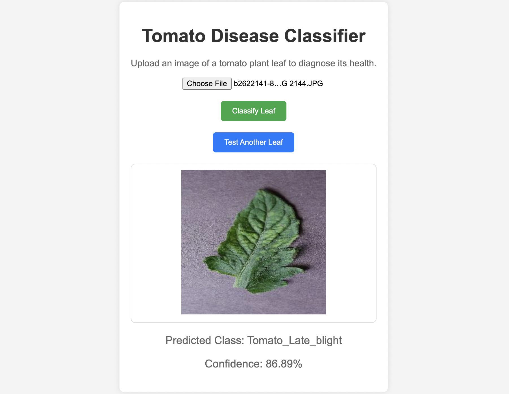

# Tomato Disease Classification

## Overview

The Tomato Disease Classifier is a machine learning-based web application designed to identify various diseases in tomato plants using images of their leaves. Utilizing the ResNet50 model, the application classifies leaf images into several categories indicating the health and potential diseases affecting the plant. This tool aims to assist farmers, gardeners, and agricultural researchers in early disease detection and management.



## Features

- **Image Upload**: Users can upload images of tomato leaves directly through the web interface.
- **Disease Classification**: The application classifies the leaf image into categories such as Bacterial Spot, Early Blight, Late Blight, etc., using a pre-trained TensorFlow model.
- **Result Display**: After processing, the application displays the classification result along with the confidence level of the prediction.
- **Responsive Design**: The web interface is user-friendly and responsive, suitable for both desktop and mobile devices.

## Installation

### Prerequisites

- Python 3.8 or higher
- TensorFlow 2.x
- FastAPI
- Uvicorn

### Setup

1. **Clone the repository**:
   ```bash
   git clone https://github.com/AaryanPotdar/tomato-disease-classifier.git
   cd tomato-disease-classifier

2. **Install dependencies**:

    ```bash
    pip install -r requirements.txt

2. **Run the application**:

    ```bash
    uvicorn main:app --reload

The application will be available at `http://localhost:8000`.

## Usage

1. **Access the Web Interface**: Open a web browser and navigate to `http://localhost:8000`.

2. **Upload an Image**: Click on the upload area or drag and drop an image of a tomato leaf.

3. **View the Prediction**: The application will display the predicted disease category and confidence level.

4. **Test Another Leaf**: To classify another leaf, click on the "Test Another Leaf" button to reset the interface and upload a new image.

## Technical Details

- **Backend**: The application is built using FastAPI and runs on a Uvicorn server. It exposes endpoints for serving the web page and processing image uploads.
- **Machine Learning Model**: The classification is performed using ResNet50 model (Transfer Learning). The model should be placed in the specified directory and loaded on application startup.
- **Frontend**: The user interface is built with HTML, CSS, and JavaScript. It includes features for image upload, preview, and displaying classification results.

## Contributing

Contributions to the Tomato Disease Classifier project are welcome. Please follow these steps to contribute:

1. **Fork the Repository**: Create a fork of the main repository on GitHub.

2. **Create a Feature Branch**: Make your changes in a new git branch.

3. **Submit a Pull Request**: Submit your changes for review.

Please adhere to the project's coding standards and guidelines.

## License

This project is licensed under the [MIT License](LICENSE.txt).

## Contact

For questions or support, please contact [aaruvpotdar@gmail.com](mailto:aaruvpotdar@gmail.com).
